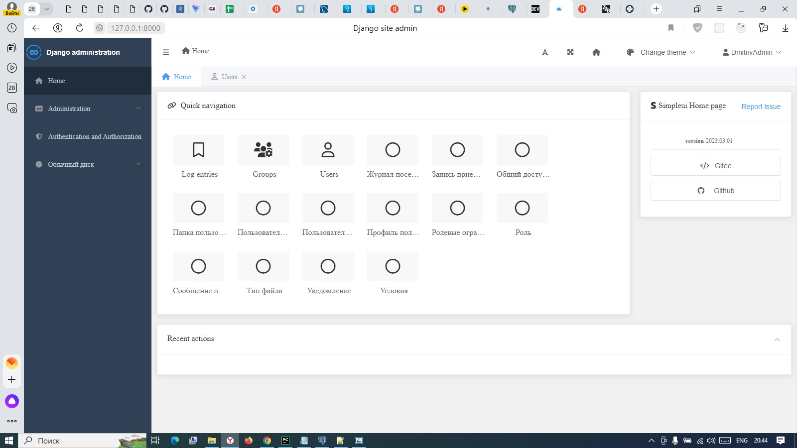
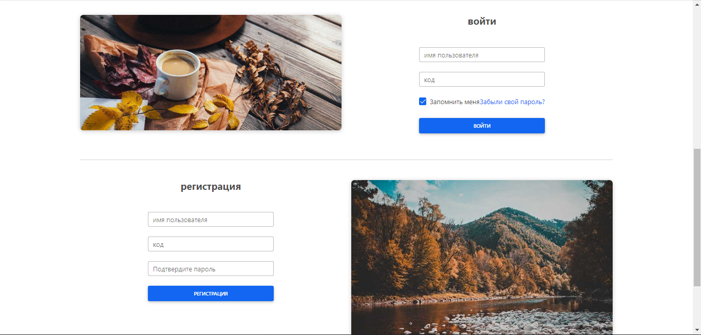
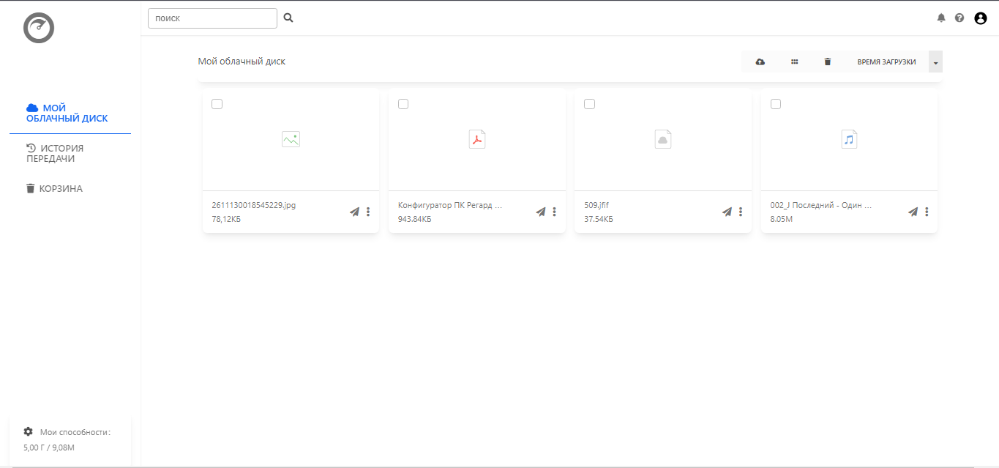
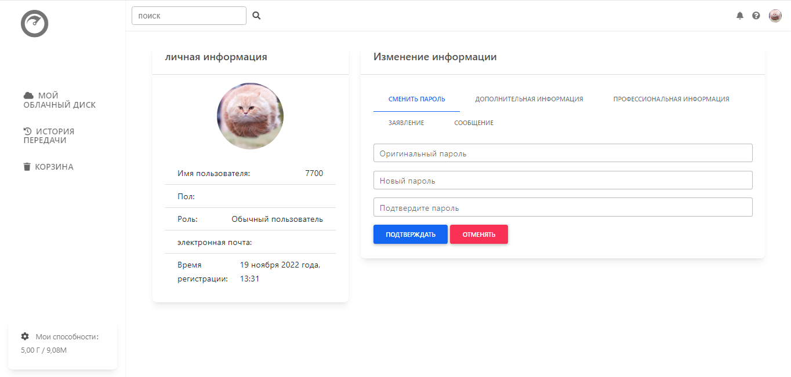

# mycloud
Мой дипломный проект  


### Запуск локально
___
1. Установка зависимостей
```
pip install -r requirements.txt
```

2. Установка зависимостей React

```
перейти в папку frontend
cd frontend
выполнить команду
npm install
```

3. Проверьте файл конфигурации, измените конфигурацию почтового ящика и базы данных
```
# mycloud/settings.py

EMAIL_HOST = 'localhost'
EMAIL_PORT = '25'
EMAIL_HOST_USER = ''
EMAIL_HOST_PASSWORD = ''
EMAIL_USE_TLS = False
DEFAULT_FROM_EMAIL = 'webmaster@localhost'


DATABASES = {
    'default': {
        'ENGINE': 'django.db.backends.postgresql_psycopg2',
        'NAME': 'cloud',
        'HOST': '127.0.0.1',
        'PORT': '5432',
        'USER': '*******',
        'PASSWORD': '********',
    }
} }
}
```

4. Настройка файла: diploma_ffpy_mycloud/pan/static/pan/js/config.js
```
Для const domain = 'http://194.67.118.206:8000' замените 194.67.118.206:8000
на 127.0.0.1:8000

```
5. Перенос базы данных
```
python manage.py migrate

```
6. Создайте суперпользователя
```
python manage.py createsuperuser
```
7. Запустите локальный сервер
```
python manage.py runserver
```
### Скриншот страницы
___ 
Панель администратора

 

Вход или Регистрация  

  

Список файлов  



Личная информация 

  

